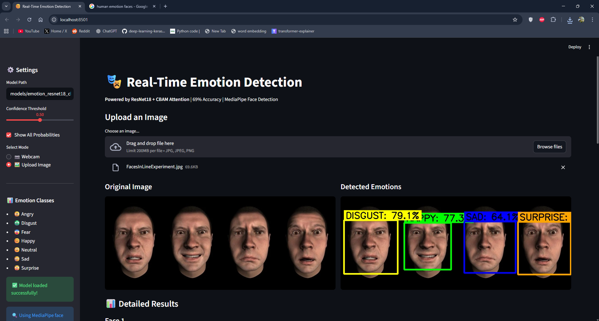
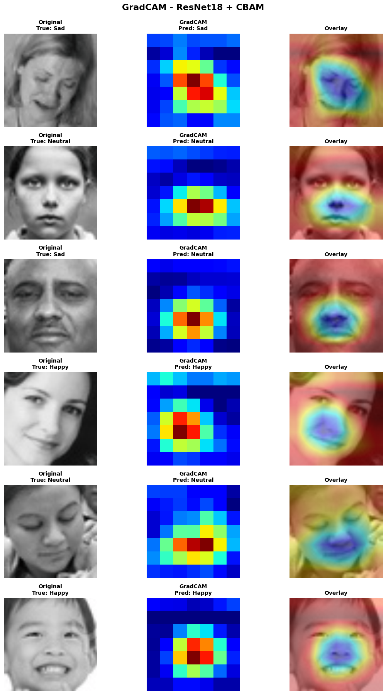
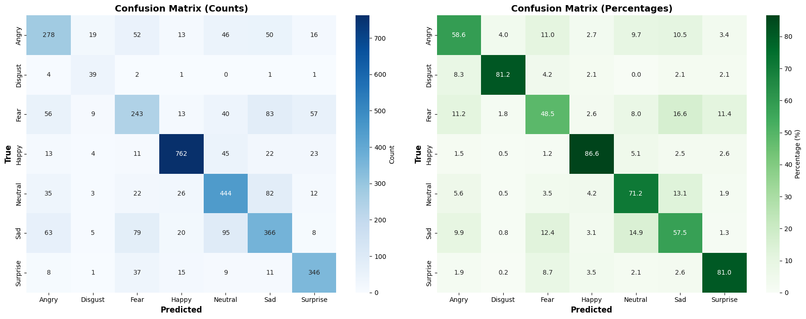

# Emotion Recognition using ResNet18 + CBAM

[](https://www.python.org/downloads/)
[](https://pytorch.org/)
[](https://opensource.org/licenses/MIT)

This project implements a deep learning pipeline for **facial emotion recognition** on the **FER2013 dataset**, using a **ResNet18 backbone enhanced with CBAM (Convolutional Block Attention Module)**.

The goal is to study how **attention mechanisms, regularization strategies, and data augmentation** affect emotion classification performance, and to deploy the final model using **Streamlit**.

---

## 📊 Dataset
- **FER2013** (Facial Expression Recognition 2013)
- **35,887 grayscale images** (48×48 pixels)
- **Split**: 80% train, 10% validation, 10% test
- **Source**: [Kaggle – FER2013 Dataset](https://www.kaggle.com/datasets/msambare/fer2013)
- **7 emotion classes**: Angry, Disgust, Fear, Happy, Neutral, Sad, Surprise

### Class Distribution
```
Happy:     ~8,900 images (most common)
Sad:       ~6,100 images
Neutral:   ~6,200 images
Angry:     ~4,950 images
Surprise:  ~4,000 images
Fear:      ~5,120 images
Disgust:   ~550 images (rare class - imbalanced!)
```

---

## 🧠 Model Architecture

### Base Model
- **ResNet18** (pretrained on ImageNet)
- **11.2M parameters**
- Modified classifier: 512 → 512 → 7 (with dropout & batch norm)

### CBAM Attention
- **Channel Attention**: Focuses on *what* is meaningful
- **Spatial Attention**: Focuses on *where* (eyes, mouth, eyebrows)
- Applied after each ResNet block (4 CBAM modules total)

### Architecture Flow
```
Input (224×224×3)
    ↓
ResNet Conv1 + BN + ReLU + MaxPool
    ↓
Layer1 (64 ch)  → CBAM1 → Attention-enhanced features
    ↓
Layer2 (128 ch) → CBAM2 → Focus on facial parts
    ↓
Layer3 (256 ch) → CBAM3 → Learn emotion patterns
    ↓
Layer4 (512 ch) → CBAM4 → High-level semantic features
    ↓
Global Average Pooling → Classifier → 7 emotions
```

---

## 🔬 Key Techniques

### 1. **Class Imbalance Handling**
- **Focal Loss** with per-class alpha weights
  - `alpha = [1.0, 3.0, 1.2, 0.7, 0.9, 1.0, 1.1]`  (then normalized)
  - `gamma = 2.0` (focus on hard examples)
- Boosts rare classes (disgust) while preventing easy classes (happy) from dominating

### 2. **Regularization**
- **Dropout**: 0.25 (prevent overfitting)
- **Label Smoothing**: 0.05 (reduce overconfidence)
- **Data Augmentation**: Horizontal flip, rotation (±10°), affine transforms, color jitter

### 3. **Transfer Learning Strategy**
- **Freeze Epochs**: 1 epoch (train classifier only)
- **Differential Learning Rates**:
  - Layer1-2 + CBAM1-2: `1e-5` (minimal updates)
  - Layer3 + CBAM3: `1e-4` (moderate updates)
  - Layer4 + CBAM4 + Classifier: `3e-4` (aggressive updates)

### 4. **Optimization**
- **Optimizer**: AdamW (no weight decay)
- **Scheduler**: CosineAnnealingWarmRestarts (T_0=10, T_mult=2)
- **Early Stopping**: Patience = 5 epochs

### 5. **Visualization**
- **GradCAM**: Shows which facial regions influence predictions
- **Confusion Matrix**: Per-class accuracy breakdown
- **Feature Maps**: Visualize what CBAM attention focuses on

---

## 🧪 Experiments Conducted

| Experiment | Configuration | Test Acc | Notes |
|------------|---------------|----------|-------|
| Baseline ResNet18 | Weighted CE, no attention | 60.9% | Class imbalance issues |
| + Focal Loss | Per-class alpha weights | 66.5% | Better minority classes |
| + CBAM Attention | Channel + Spatial | **69.0%** | Focus on facial features |


### What We Learned
- ✅ **CBAM attention** improves accuracy by ~3%
- ✅ **Focal Loss** handles imbalance better than weighted CE 
- ✅ **Differential LR** stabilizes fine-tuning
- ✅ **Warm Restarts** help escape local minima
- ⚠️ **Disgust** remains challenging (rare class, only 550 samples)
- ⚠️ **Fear** and **Sad** get mixed up by every model

---

## 📈 Results (Best Model)

### Overall Performance
| Metric | Value |
|--------|-------|
| **Test Accuracy** | **69.0%** |
| **Validation Accuracy** | **68.1%** |
| **Training Time** | 21 epochs (~2 hours on RTX 3060) |
| **Parameters** | 11.5M |


**Key Observations:**
- ✅ **Happy & Surprise**: High accuracy (clear facial expressions)
- ⚠️ **Fear**: Low recall (ambiguous expressions)
- ⚠️ **Disgust**: High recall but low precision (over-predicted due to class weighting)

---

## 🚀 Streamlit App

### Features
- 📷 **Real-time webcam detection**
- 🖼️ **Image upload mode**
- 🎚️ **Confidence threshold slider**
- 📊 **Live probability charts**
- 🎨 **Color-coded emotions**
- 🔍 **MediaPipe face detection** 

### Run the App
```bash
# Install dependencies
pip install -r requirements.txt

# Run Streamlit app
streamlit run app/emotion_app.py
```

### Demo


---

## 📁 Project Structure
```
EMOTION-DETECTION/
├── notebooks/
│   └── emotion.ipynb
├── app/
│   └── emotion_app.py          # Streamlit application
├── models/
│   ├── emotion_resnet18_cbam_latest.pth
│   └── emotion_resnet18_cbam_acc67.31_20260103_065836.pth
├── data/
│   ├── train/
│   └── test/
├── requirements.txt
├── README.md
└── LICENSE

```

### Setup
```bash
# Clone repository
git clone https://github.com/amrani-213/emotion_detection.git
cd emotion-recognition

# Create virtual environment
python -m venv emotion-pt
# Activate
# Windows (PowerShell / CMD)
emotion-pt\Scripts\activate

# macOS / Linux
source emotion-pt/bin/activate

# Install dependencies
pip install -r requirements.txt

# Download FER2013 dataset
# Place in data/train and data/test folders
```

---

## 🏋️ Training

### Quick Start
```bash
# Run training notebook
jupyter notebook notebooks/emotion.ipynb
```

### Training Configuration
```python
EPOCHS = 40
BATCH_SIZE = 32
LEARNING_RATE = 3e-4
DROPOUT_RATE = 0.25
FOCAL_ALPHA = [1.0, 3.0, 1.2, 0.7, 0.9, 1.0, 1.1]
FREEZE_EPOCHS = 1
```

### Hardware Requirements

- **Recommended**: 16GB RAM, RTX 3060 (12GB VRAM)
- **Training Time**: ~35 minutes on RTX 3060 (ResNetCBAM)

---

## 📊 Visualization

### GradCAM Attention Maps
Shows which facial regions the model focuses on:
```python
# Red areas = high attention (eyes, mouth, eyebrows)
# Blue areas = low attention (background)
```


### Confusion Matrix


---

## 🔮 Future Work

- [ ] **Try Vision Transformers** (ViT, Swin Transformer)
- [ ] **Ensemble multiple models** (ResNet + EfficientNet + ViT)
- [ ] **Multi-task learning** (emotion + AU detection)
- [ ] **Video emotion recognition** (temporal modeling)
- [ ] **Deploy to cloud** (AWS/GCP/Azure)
- [ ] **Mobile optimization** (ONNX, TensorRT)
- [ ] **Real-time performance** (<30ms inference)

---

## 📚 References

### Papers
1. **CBAM**: Woo et al., "CBAM: Convolutional Block Attention Module" (ECCV 2018)
2. **Focal Loss**: Lin et al., "Focal Loss for Dense Object Detection" (ICCV 2017)
3. **ResNet**: He et al., "Deep Residual Learning for Image Recognition" (CVPR 2016)

### Datasets
- [FER2013 on Kaggle](https://www.kaggle.com/datasets/msambare/fer2013)

### Inspiration
- [Facial Expression Recognition Survey](https://arxiv.org/abs/1804.08348)
- [Attention Mechanisms in Computer Vision](https://arxiv.org/abs/2111.07624)

---


---

## 📄 License

This project is licensed under the MIT License - see the [LICENSE](LICENSE) file for details.

---

## 👨‍💻 Author

**Your Name**
- GitHub: [@amrani-213](https://github.com/yourusername)
- LinkedIn: [amrani-bouabdellah](https://www.linkedin.com/in/amrani-bouabdellah-430169349/)
- Email: abdouugk@gmail.com

---

## 🙏 Acknowledgments

- FER2013 dataset creators
- PyTorch team
- CBAM paper authors
- Streamlit for the amazing framework
- Mehizel Ali
- https://github.com/Serhii2009
---

## 📞 Contact

Questions or suggestions? Feel free to:
- Open an issue
- Email me at abdouugk@gmail.com
- Connect on LinkedIn

---
