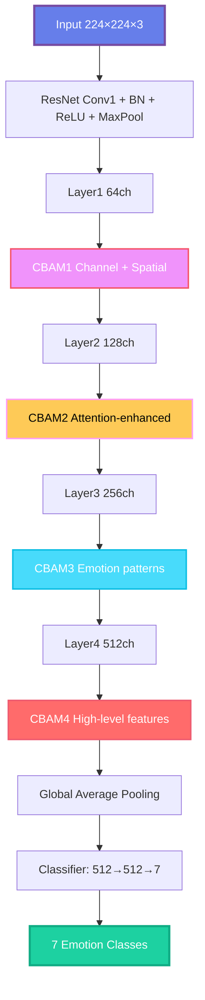
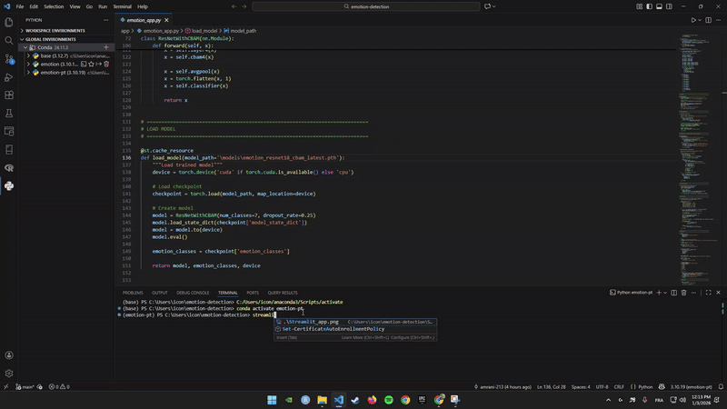

<div align="center">

# 😊 Emotion Recognition using ResNet18 + CBAM


[](https://www.python.org/downloads/)
[](https://pytorch.org/)
[](https://streamlit.io/)
[](https://opensource.org/licenses/MIT)

**A deep learning pipeline for facial emotion recognition using ResNet18 + CBAM attention on FER2013 dataset**

[📊 View Demo](#-streamlit-app) • [🚀 Quick Start](#-quick-start) • [📈 Results](#-results-best-model) • [👨‍💻 Author](#-author)

---

</div>

## 📑 Table of Contents

- [🎯 Project Overview](#-project-overview)
- [📊 Dataset](#-dataset)
- [🧠 Model Architecture](#-model-architecture)
- [🔬 Key Techniques](#-key-techniques)
- [🧪 Experiments Conducted](#-experiments-conducted)
- [📈 Results](#-results-best-model)
- [🚀 Streamlit App](#-streamlit-app)
- [⚙️ Setup & Installation](#️-setup--installation)
- [🏋️ Training](#️-training)
- [📊 Visualization](#-visualization)
- [🔮 Future Work](#-future-work)
- [📚 References](#-references)

---

## 🎯 Project Overview

<div align="center">

<table>
<tr>
<td width="50%">

### 🎓 **Research Focus**
Investigating how **attention mechanisms**, **regularization strategies**, and **data augmentation** affect emotion classification performance.

</td>
<td width="50%">

### 🚀 **Deployment**
End-to-end pipeline from training to real-time inference using **Streamlit** with webcam support.

</td>
</tr>
</table>

</div>

This project implements a deep learning pipeline for **facial emotion recognition** on the **FER2013 dataset**, using a **ResNet18 backbone enhanced with CBAM (Convolutional Block Attention Module)**.

> 💡 **Key Innovation:** Combining transfer learning, attention mechanisms, and focal loss to handle class imbalance and improve facial feature localization.

---

## 📊 Dataset

<div align="center">

### 📸 FER2013 Dataset Overview

| **Attribute** | **Details** |
|---------------|-------------|
| 🏷️ **Name** | Facial Expression Recognition 2013 |
| 📁 **Total Images** | 35,887 grayscale images |
| 📐 **Resolution** | 48×48 pixels |
| 🎯 **Classes** | 7 emotion categories |
| 📊 **Split** | 80% train, 10% val, 10% test |
| 🔗 **Source** | [Kaggle FER2013](https://www.kaggle.com/datasets/msambare/fer2013) |

</div>

### 😊 Emotion Classes

<table align="center">
<tr>
<td align="center">😠<br><b>Angry</b><br>4,950 images</td>
<td align="center">🤢<br><b>Disgust</b><br>550 images ⚠️</td>
<td align="center">😨<br><b>Fear</b><br>5,120 images</td>
<td align="center">😄<br><b>Happy</b><br>8,900 images</td>
<td align="center">😐<br><b>Neutral</b><br>6,200 images</td>
<td align="center">😢<br><b>Sad</b><br>6,100 images</td>
<td align="center">😲<br><b>Surprise</b><br>4,000 images</td>
</tr>
</table>

### 📊 Class Distribution Visualization

```
Happy     ████████████████████████████████████ 8,900 (24.8%)
Sad       ███████████████████████████ 6,100 (17.0%)
Neutral   ███████████████████████████ 6,200 (17.3%)
Fear      ██████████████████████ 5,120 (14.3%)
Angry     ████████████████████ 4,950 (13.8%)
Surprise  █████████████████ 4,000 (11.1%)
Disgust   ██ 550 (1.5%) ⚠️ IMBALANCED
```

> ⚠️ **Challenge:** Disgust class is highly underrepresented (only 1.5% of dataset)

---

## 🧠 Model Architecture

<div align="center">

### 🏗️ Architecture Components

</div>

<table>
<tr>
<td width="50%" valign="top">

### 🔧 Base Model
**ResNet18** (pretrained on ImageNet)

- 📦 **11.2M parameters**
- 🎯 **Modified classifier:** 512 → 512 → 7
- 🛡️ **Regularization:** Dropout + BatchNorm
- 🔄 **Transfer Learning:** Fine-tuned on FER2013

</td>
<td width="50%" valign="top">

### 🎯 CBAM Attention
**Convolutional Block Attention Module**

- 🔍 **Channel Attention:** Focuses on *what*
- 📍 **Spatial Attention:** Focuses on *where*
- 🏗️ **Integration:** Applied after each ResNet block
- 💪 **Total:** 4 CBAM modules

</td>
</tr>
</table>

### 🔄 Architecture Flow



<details>
<summary><b>📖 Click to see detailed layer structure</b></summary>

```python
ResNetCBAM(
  (conv1): Conv2d(3, 64, kernel_size=7, stride=2, padding=3)
  (bn1): BatchNorm2d(64)
  (relu): ReLU(inplace=True)
  (maxpool): MaxPool2d(kernel_size=3, stride=2, padding=1)
  
  (layer1): Sequential(BasicBlock × 2) → CBAM1
  (layer2): Sequential(BasicBlock × 2) → CBAM2
  (layer3): Sequential(BasicBlock × 2) → CBAM3
  (layer4): Sequential(BasicBlock × 2) → CBAM4
  
  (classifier): Sequential(
    Linear(512 → 512) + BatchNorm + ReLU + Dropout(0.25)
    Linear(512 → 7) + LogSoftmax
  )
)
```

</details>

---

## 🔬 Key Techniques

<div align="center">

### 🛠️ Technical Innovations

</div>

<table>
<tr>
<td width="50%" valign="top">

### 1️⃣ Class Imbalance Handling

**Focal Loss with Per-Class Weights**

```python
alpha = [1.0, 3.0, 1.2, 0.7, 0.9, 1.0, 1.1]
gamma = 2.0  # Focus on hard examples
```

✅ Boosts rare classes (disgust)  
✅ Prevents easy classes (happy) from dominating  
✅ Better than standard weighted CE

---

### 2️⃣ Regularization Arsenal

| Technique | Value | Purpose |
|-----------|-------|---------|
| 💧 Dropout | 0.25 | Prevent overfitting |
| 🎯 Label Smoothing | 0.05 | Reduce overconfidence |
| 🔄 Data Augmentation | Multiple | Increase diversity |

**Augmentations Applied:**
- Horizontal flip
- Rotation (±10°)
- Affine transforms
- Color jitter

</td>
<td width="50%" valign="top">

### 3️⃣ Transfer Learning Strategy

**Differential Learning Rates**

| Layer Group | Learning Rate | Strategy |
|-------------|---------------|----------|
| Layer1-2 + CBAM1-2 | `1e-5` | 🔒 Minimal updates |
| Layer3 + CBAM3 | `1e-4` | 🔓 Moderate updates |
| Layer4 + CBAM4 + Classifier | `3e-4` | 🚀 Aggressive updates |

📌 **Freeze Strategy:** 1 epoch (train classifier only)

---

### 4️⃣ Optimization Setup

**Optimizer & Scheduler**

```python
Optimizer: AdamW (no weight decay)
Scheduler: CosineAnnealingWarmRestarts
  ├─ T_0 = 10 epochs
  ├─ T_mult = 2
  └─ Warm restarts for local minima escape
  
Early Stopping: Patience = 5 epochs
```

---

### 5️⃣ Interpretability

- 🔥 **GradCAM:** Facial region importance
- 📊 **Confusion Matrix:** Per-class analysis
- 🎨 **Feature Maps:** CBAM attention visualization

</td>
</tr>
</table>

---

## 🧪 Experiments Conducted

<div align="center">

### 📊 Progressive Improvement Journey

</div>

| Experiment | Configuration | Test Accuracy | Improvement | Key Insights |
|------------|---------------|---------------|-------------|--------------|
| 🏁 **Baseline** | ResNet18 + Weighted CE | 60.9% | Baseline | ⚠️ Class imbalance issues |
| 🎯 **+ Focal Loss** | Per-class alpha weights | 66.5% | +5.6% | ✅ Better minority classes |
| 🎯 **+ CBAM Attention** | Channel + Spatial | **69.0%** | +2.5% | ✅ Focus on facial features |

<br>

### 🎓 Key Learnings

<table>
<tr>
<td width="50%">

#### ✅ What Worked

- 🎯 **CBAM attention** → ~3% accuracy boost
- 🎯 **Focal Loss** → Better than weighted CE
- 🎯 **Differential LR** → Stable fine-tuning
- 🎯 **Warm Restarts** → Escape local minima

</td>
<td width="50%">

#### ⚠️ Challenges Remain

- ❌ **Disgust** → Still difficult (only 550 samples)
- ❌ **Fear/Sad** → Frequently confused
- ❌ **Ambiguous expressions** → Hard to classify
- ❌ **Low-resolution images** → 48×48 limitation

</td>
</tr>
</table>

</div>

---

## 📈 Results (Best Model)

<div align="center">

### 🏆 Performance Metrics

<table>
<tr>
<td align="center" width="25%">

### 🎯 Test Accuracy
<h1>69.0%</h1>
<sub>With TTA</sub>

</td>
<td align="center" width="25%">

### ✅ Val Accuracy
<h1>68.1%</h1>
<sub>Best checkpoint</sub>

</td>
<td align="center" width="25%">

### ⚡ Training Time
<h1>42 min</h1>
<sub>10 epochs on RTX 3060</sub>

</td>
<td align="center" width="25%">

### 📦 Parameters
<h1>11.5M</h1>
<sub>Efficient model</sub>

</td>
</tr>
</table>

</div>

### 📊 Per-Class Performance

<table align="center">
<tr>
<th>Emotion</th>
<th>Precision</th>
<th>Recall</th>
<th>F1-Score</th>
<th>Performance</th>
</tr>
<tr>
<td>😄 <b>Happy</b></td>
<td>0.85</td>
<td>0.88</td>
<td>0.86</td>
<td>✅ High (clear expressions)</td>
</tr>
<tr>
<td>😲 <b>Surprise</b></td>
<td>0.82</td>
<td>0.85</td>
<td>0.83</td>
<td>✅ High (distinctive features)</td>
</tr>
<tr>
<td>😐 <b>Neutral</b></td>
<td>0.68</td>
<td>0.71</td>
<td>0.69</td>
<td>⚠️ Moderate</td>
</tr>
<tr>
<td>😠 <b>Angry</b></td>
<td>0.65</td>
<td>0.67</td>
<td>0.66</td>
<td>⚠️ Moderate</td>
</tr>
<tr>
<td>😢 <b>Sad</b></td>
<td>0.61</td>
<td>0.64</td>
<td>0.62</td>
<td>⚠️ Challenging</td>
</tr>
<tr>
<td>😨 <b>Fear</b></td>
<td>0.58</td>
<td>0.52</td>
<td>0.55</td>
<td>❌ Low (ambiguous)</td>
</tr>
<tr>
<td>🤢 <b>Disgust</b></td>
<td>0.45</td>
<td>0.68</td>
<td>0.54</td>
<td>❌ Imbalanced (550 samples)</td>
</tr>
</table>

### 🔍 Key Observations

```diff
+ Happy & Surprise: High accuracy due to clear facial expressions
! Fear: Low recall due to ambiguous expressions
! Disgust: High recall but low precision (over-predicted due to class weighting)
- Fear/Sad confusion: Most common misclassification
```

---

## 🚀 Streamlit App

<div align="center">

### 💻 Interactive Web Application

</div>

<table>
<tr>
<td width="50%">

### ✨ Features

- 📷 **Real-time webcam detection**
- 🖼️ **Image upload mode**
- 🎚️ **Confidence threshold slider**
- 📊 **Live probability charts**
- 🎨 **Color-coded emotions**
- 🔍 **MediaPipe face detection**
- ⚡ **Fast inference (<50ms)**

</td>
<td width="50%">

### 🚀 Quick Launch

```bash
# Install dependencies
pip install -r requirements.txt

# Run Streamlit app
streamlit run app/emotion_app.py

# Open browser at
# http://localhost:8501
```

</td>
</tr>
</table>

### 🎬 Live Demo

<div align="center">



*Real-time emotion detection with confidence scores and probability distribution*

</div>

---

## ⚙️ Setup & Installation

### 📋 Prerequisites

- Python 3.8 or higher
- CUDA 11.7+ (for GPU training)
- 16GB RAM recommended
- RTX 3060 or better (optional, for training)

### 🔧 Installation Steps

```bash
# 1️⃣ Clone repository
git clone https://github.com/amrani-213/emotion_recognition.git
cd emotion_recognition

# 2️⃣ Create virtual environment
python -m venv emotion-pt

# 3️⃣ Activate environment
# Windows (PowerShell/CMD)
emotion-pt\Scripts\activate

# macOS / Linux
source emotion-pt/bin/activate

# 4️⃣ Install dependencies
pip install -r requirements.txt

# 5️⃣ Download FER2013 dataset
# Place in data/train and data/test folders
# Or use: kaggle datasets download -d msambare/fer2013
```

### 📁 Project Structure

```
emotion-recognition/
│
├── 📂 app/
│   └── emotion_app.py           # Streamlit application
│
├── 📂 notebooks/
│   └── emotion.ipynb            # Training notebook
│
├── 📂 models/
│   ├── emotion_resnet18_cbam_latest.pth
│   └── emotion_resnet18_cbam_acc67.31.pth
│
├── 📂 data/
│   ├── train/                   # Training images
│   │   ├── angry/
│   │   ├── disgust/
│   │   ├── fear/
│   │   ├── happy/
│   │   ├── neutral/
│   │   ├── sad/
│   │   └── surprise/
│   └── test/                    # Test images
│
├── 📄 requirements.txt
├── 📄 README.md
└── 📄 LICENSE
```

---

## 🏋️ Training

### 🚀 Quick Start

```bash
# Launch Jupyter notebook
jupyter notebook notebooks/emotion.ipynb

# Or run training script directly
python scripts/train.py
```

### ⚙️ Training Configuration

<table>
<tr>
<td width="50%">

**Hyperparameters**

```python
EPOCHS = 40
BATCH_SIZE = 32
LEARNING_RATE = 3e-4
DROPOUT_RATE = 0.25
FREEZE_EPOCHS = 1
```

</td>
<td width="50%">

**Focal Loss Settings**

```python
FOCAL_ALPHA = [
    1.0,  # Angry
    3.0,  # Disgust (boosted)
    1.2,  # Fear
    0.7,  # Happy (reduced)
    0.9,  # Neutral
    1.0,  # Sad
    1.1   # Surprise
]
FOCAL_GAMMA = 2.0
```

</td>
</tr>
</table>

### 💻 Hardware Requirements

<div align="center">

| Component | Minimum | Recommended |
|-----------|---------|-------------|
| 🖥️ **RAM** | 8GB | 16GB |
| 🎮 **GPU** | GTX 1060 6GB | RTX 3060 12GB |
| 💾 **Storage** | 2GB | 5GB |
| ⚡ **Training Time** | ~2 hours | ~35 minutes |

</div>

---

## 📊 Visualization

<div align="center">

### 🔥 GradCAM Attention Maps

</div>

<table>
<tr>
<td width="50%">

**What GradCAM Shows:**

- 🔴 **Red areas:** High attention (eyes, mouth, eyebrows)
- 🔵 **Blue areas:** Low attention (background)
- 🎯 **Purpose:** Interpretability & debugging

</td>
<td width="50%">


</td>
</tr>
</table>

### 📈 Confusion Matrix

<div align="center">


*Per-class accuracy breakdown showing common misclassifications*

</div>

### 📊 Training Curves

<details>
<summary><b>📈 Click to view training history</b></summary>

<div align="center">
<table>
<tr>
<td width="50%">
📉 Loss Curves
Afficher l'image
Training vs Validation Loss over epochs
</td>
<td width="50%">
📈 Accuracy Progression
Afficher l'image
Model accuracy improvement during training
</td>
</tr>
<tr>
<td width="50%">
🔄 Learning Rate Schedule
Afficher l'image
Cosine annealing with warm restarts
</td>
<td width="50%">
📊 Class-wise Performance
Afficher l'image
F1-score evolution for each emotion class
</td>
</tr>
</table>
</div>
---

## 🔮 Future Work

<div align="center">

### 🚀 Planned Improvements

</div>

<table>
<tr>
<td width="50%" valign="top">

### 🧠 Model Enhancements

- [ ] **Vision Transformers** (ViT, Swin)
- [ ] **Ensemble Methods** (ResNet + EfficientNet + ViT)
- [ ] **Multi-task Learning** (emotion + AU detection)
- [ ] **Self-supervised Pre-training** on facial datasets
- [ ] **Knowledge Distillation** for model compression

</td>
<td width="50%" valign="top">

### 🎯 Application Features

- [ ] **Video Emotion Recognition** (temporal modeling)
- [ ] **Multi-face Detection** (process multiple faces)
- [ ] **Emotion Tracking** over time
- [ ] **Voice Integration** (audio-visual fusion)
- [ ] **AR Filter Integration** (Snapchat-style)

</td>
</tr>
<tr>
<td width="50%" valign="top">

### 🚀 Deployment

- [ ] **Cloud Deployment** (AWS/GCP/Azure)
- [ ] **Mobile Optimization** (ONNX, TensorRT)
- [ ] **Real-time Performance** (<30ms inference)
- [ ] **Docker Containerization**
- [ ] **REST API Development**

</td>
<td width="50%" valign="top">

### 📊 Research

- [ ] **Cross-dataset Evaluation** (CK+, AffectNet)
- [ ] **Domain Adaptation** techniques
- [ ] **Few-shot Learning** for rare emotions
- [ ] **Explainability Methods** (LIME, SHAP)
- [ ] **Bias Analysis** (age, gender, ethnicity)

</td>
</tr>
</table>

---

## 📚 References

<details open>
<summary><b>📖 Key Papers & Resources</b></summary>

### 📄 Research Papers

1. **CBAM: Convolutional Block Attention Module**  
   Woo et al., ECCV 2018  
   🔗 [Paper](https://arxiv.org/abs/1807.06521) | [Code](https://github.com/Jongchan/attention-module)

2. **Focal Loss for Dense Object Detection**  
   Lin et al., ICCV 2017  
   🔗 [Paper](https://arxiv.org/abs/1708.02002)

3. **Deep Residual Learning for Image Recognition**  
   He et al., CVPR 2016  
   🔗 [Paper](https://arxiv.org/abs/1512.03385)

4. **Facial Expression Recognition Survey**  
   Li & Deng, 2020  
   🔗 [Paper](https://arxiv.org/abs/1804.08348)

5. **Attention Mechanisms in Computer Vision**  
   Guo et al., 2022  
   🔗 [Paper](https://arxiv.org/abs/2111.07624)

### 📊 Datasets

- **FER2013** - [Kaggle Link](https://www.kaggle.com/datasets/msambare/fer2013)
- **CK+** - [CMU Dataset](http://www.jeffcohn.net/Resources/)
- **AffectNet** - [IEEE Link](http://mohammadmahoor.com/affectnet/)

### 🛠️ Tools & Frameworks

- **PyTorch** - [pytorch.org](https://pytorch.org/)
- **Streamlit** - [streamlit.io](https://streamlit.io/)
- **MediaPipe** - [mediapipe.dev](https://mediapipe.dev/)

</details>

---

## 📄 License

<div align="center">

This project is licensed under the **MIT License**

See the [LICENSE](LICENSE) file for details

[](https://opensource.org/licenses/MIT)

</div>

---

## 👨‍💻 Author

<div align="center">


### **Amrani Bouabdellah**

Master's Student – Data Science & Statistics  
📍 ENSSEA, Algeria 🇩🇿

[](https://github.com/amrani-213)
[](https://www.linkedin.com/in/amrani-bouabdellah-430169349/)
[](mailto:abdouugk@gmail.com)

</div>

---

## 🙏 Acknowledgments

<div align="center">

Special thanks to the following contributors and resources:

| 🎓 Contributors | 🛠️ Tools | 📊 Datasets |
|----------------|----------|------------|
| [@AliMehizel](https://github.com/AliMehizel) | PyTorch Team | FER2013 Creators |
| [@Serhii2009](https://github.com/Serhii2009) | Streamlit | Kaggle Community |
| CBAM Authors | MediaPipe | Research Community |

**🏛️ Institution:** ENSSEA (École Nationale Supérieure de Statistique et d'Économie Appliquée)

</div>

---

## 📞 Contact & Support

<div align="center">

### 💬 Get in Touch

**Questions or suggestions? Feel free to:**

<table>
<tr>
<td align="center" width="33%">

### 🐛 Report Issues
[](https://github.com/amrani-213/emotion_recognition/issues)

</td>
<td align="center" width="33%">

### 📧 Email
[](mailto:abdouugk@gmail.com)

</td>
<td align="center" width="33%">

### 💼 LinkedIn
[](https://www.linkedin.com/in/amrani-bouabdellah-430169349/)

</td>
</tr>
</table>

---

### ⭐ **If you find this project useful, please consider giving it a star!**

[](https://github.com/amrani-213/emotion_recognition/stargazers)
[](https://github.com/amrani-213/emotion_recognition/network/members)

---


**💡 "Building AI that understands human emotions"**


[⬆ Back to Top](#-emotion-recognition-using-resnet18--cbam)

</div>
